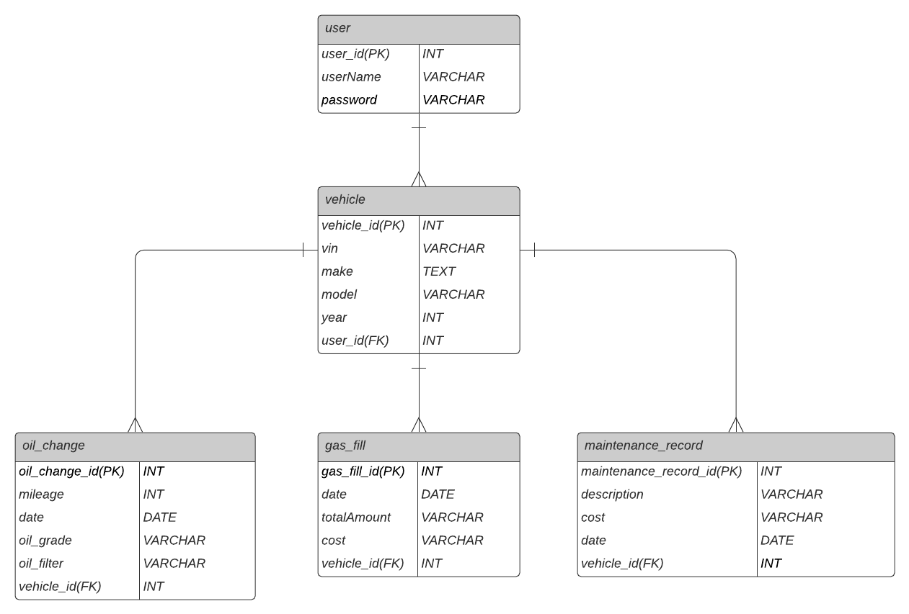
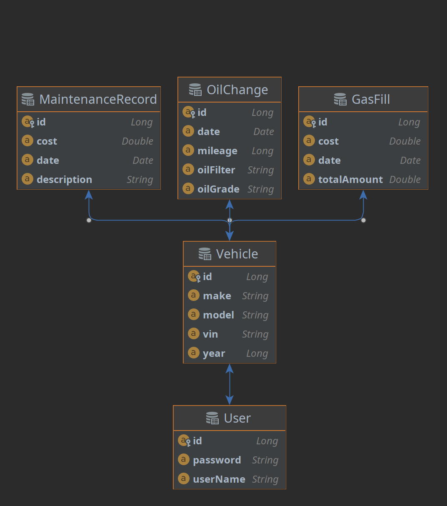
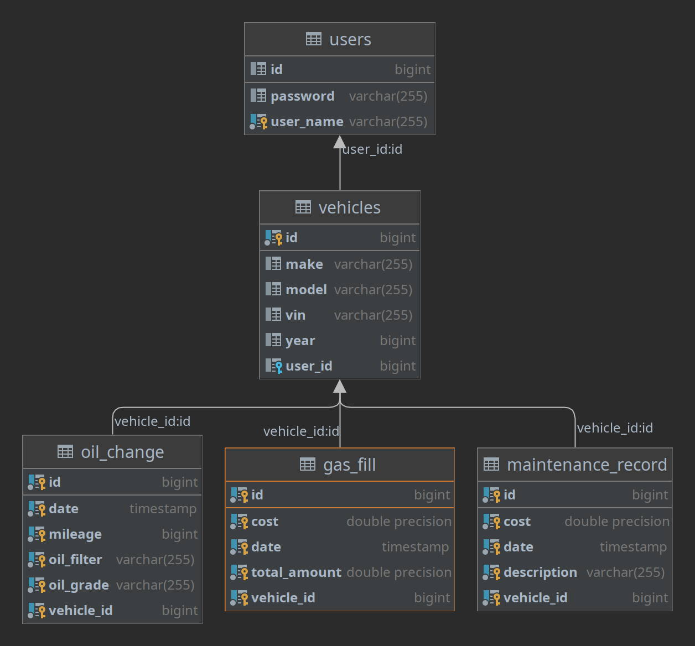

<h1 align="center">Garage_Tracker_API</h1>


<h3 align="center"> Tracking the history of your car maintenance</h3>

<p align="center"> </p> 


## Table of Contents
* [User Stories](#User-Stories)
* [Tools Used](#Tools-Used)
* [Installation](#Installation)
* [POM Dependencies](#POM-Dependencies)
* [Entity Relationship Diagram (ERD)](#Entity-Relationship-Diagram)
* [Model View Controller System Design](#Model-View-Controller-System-Design)
* [API Endpoints](#Endpoints)
* [Database Layout](#Database-Layout)
* [Sample of Output](#Sample-of-Output)
* [Project File Structure](#Project-Structure)


This project is just one part of a two part project. This backend API holds the data for the garage.
Data can be written to and read from the database from the front end component of the project. 
The user would be able to store their vehicle data such as make, model, year, as well as VIN. 
Each vehicle can contain records of work done on the vehicle such as oil changes, gas fill ups, 
and any other maintenance records. 

### The Approach
I first started with the ERD to flush out how the API would be structured. 
This made the subsequent work much easier because the planning was done ahead of touching any code.
The first thing I did was set up the folder structure ahead of time because I knew what I wanted and how I wanted to structure the project.
I started creating the models first since they are the basis of the other components. For each model I first created the repository
then created the service, then the controller. I found this make more sense because 
the controller relies on the service which relies on the repository which relies on the model. 


### Unsolved Problems or Major Hurdles
One issue I ran into was a Cross-Origin Resource Sharing (CORS) error. 
While working fine with getting data with Postman, when I connected my front-end application to the back-end api I ran into the CORS issue. 
After a bit of research I found a solution, which was to include `@CrossOrigin(origins = {"https://garagetracker.herokuapp.com", "http://localhost:4200"})` 
which seems to have solved the issue. At first, I had only the localhost but when deployed I ran into the same issue, so I added the address of the deployed site as well.

### Todo
- [ ] Add user role to save data per user.
- [ ] Add login and signup
- [ ] Add security
- [ ] Add more integration and unit testing

## User Stories
- [x] As a user I would like to add vehicles
- [x] As a user I would like to log my oil changes
- [x] As a user I would like to log my gas fills
- [x] As a user I would like to log any maintenance done
- [x] As a user I would each record to be associated with a vehicle
- [x] As a user I would like a way to see all the records of a particular type
- [ ] As a user I would like to create an account

## Tools Used

|                                                                              |               |
|:----------------------------------------------------------------------------:|:-------------:|
|      |  Spring Boot  |
|  | IntelliJ IDEA |
|                    |     Java      |
|                | Apache Maven  |
|             |  PostgreSQL   |
|                   |    Postman    |
|                 |    Heroku     |
|               |  Lucidcharts  |


## Installation
- Install [PostgreSQL](https://www.postgresql.org/download/). Using the localhost with port 5432, create a database named garage.
- Update application-dev.properties with your username and password. 
- Update datasource to match your local database
- To test endpoints use [Postman](https://www.postman.com/). 


## POM Dependencies
```xml
<dependencies>
        <dependency>
            <groupId>org.springframework.session</groupId>
            <artifactId>spring-session-core</artifactId>
        </dependency>

        <dependency>
            <groupId>org.springframework.boot</groupId>
            <artifactId>spring-boot-devtools</artifactId>
            <scope>runtime</scope>
            <optional>true</optional>
        </dependency>
        <dependency>
            <groupId>org.postgresql</groupId>
            <artifactId>postgresql</artifactId>
            <scope>runtime</scope>
        </dependency>
        <dependency>
            <groupId>org.springframework.boot</groupId>
            <artifactId>spring-boot-starter-test</artifactId>
            <scope>test</scope>
        </dependency>
        <dependency>
            <groupId>org.springframework.security</groupId>
            <artifactId>spring-security-test</artifactId>
            <scope>test</scope>
        </dependency>
        <dependency>
            <groupId>org.springframework.boot</groupId>
            <artifactId>spring-boot-starter-data-jpa</artifactId>
        </dependency>
        <dependency>
            <groupId>org.springframework.boot</groupId>
            <artifactId>spring-boot-starter-web</artifactId>
            <version>2.6.3</version>
        </dependency>
    </dependencies>
```
## Entity Relationship Diagram


### Initial ERD

### Project ERD


## Model View Controller System Design
- 5 Model Classes
- 5 Controller Classes
- 5 Service Classes
- 5 Repository Interfaces
- 9 API endpoints


## Endpoints


| Request Type | URL                                   | Request Body                      | Request Header |
|--------------|:--------------------------------------|:----------------------------------|----------------|
| GET          | /api/vehicles                         |                                   |                |
| GET          | /api/vehicles/{vehicleId}             |                                   |                |
| POST         | /api/vehicles                         | vin, make, model, year            |                |
| GET          | /api/vehicles/{vehicleId}/oil         |                                   |                |
| POST         | /api/vehicles/{vehicleId}/oil         | milage, date, oilGrade, oilFilter |                |
| GET          | /api/vehicles/{vehicleId}/gas         |                                   |                |
| POST         | /api/vehicles/{vehicleId}/gas         | date, totalAmount, cost           |                |
| GET          | /api/vehicles/{vehicleId}/maintenance |                                   |                |
| POST         | /api/vehicles/{vehicleId}/maintenance | description, cost, date           |                |


## Database Layout

## Sample of Output
```json
[
    {
        "id": 2,
        "vin": "1FA6P8CFXL5136010",
        "make": "Ford",
        "model": "Mustang",
        "year": 2020,
        "oilChangeList": [
            {
                "id": 5,
                "mileage": 5192,
                "date": "05/06/2021",
                "oilGrade": "5W20",
                "oilFilter": "K&N"
            },
            {
                "id": 6,
                "mileage": 8532,
                "date": "07/16/2021",
                "oilGrade": "5W20",
                "oilFilter": "K&N"
            },
            {
                "id": 7,
                "mileage": 12532,
                "date": "12/26/2021",
                "oilGrade": "5W20",
                "oilFilter": "K&N"
            },
            {
                "id": 11,
                "mileage": 14200,
                "date": "02/01/2022",
                "oilGrade": "5W20",
                "oilFilter": "K&N"
            }
        ],
        "gasFillList": [
            {
                "id": 6,
                "date": "05/29/2020",
                "totalAmount": 19.9,
                "cost": 3.29
            },
            {
                "id": 7,
                "date": "06/07/2020",
                "totalAmount": 15.9,
                "cost": 3.52
            },
            {
                "id": 8,
                "date": "06/15/2020",
                "totalAmount": 17.9,
                "cost": 3.59
            },
            {
                "id": 9,
                "date": "06/23/2020",
                "totalAmount": 19.9,
                "cost": 3.69
            }
        ],
        "maintenanceRecordList": [
            {
                "id": 1,
                "description": "Battery",
                "cost": 75.15,
                "date": "03/20/0021"
            },
            {
                "id": 5,
                "description": "4 New Tires ",
                "cost": 524.25,
                "date": "02/24/2022"
            }
        ]
    },
    {
        "id": 3,
        "vin": "WUANWAF53MA904781",
        "make": "Audi",
        "model": "RS 5",
        "year": 2021,
        "oilChangeList": [
            {
                "id": 8,
                "mileage": 3505,
                "date": "02/26/2021",
                "oilGrade": "5W10",
                "oilFilter": "Royal Purple"
            },
            {
                "id": 9,
                "mileage": 8505,
                "date": "05/06/2021",
                "oilGrade": "5W10",
                "oilFilter": "Royal Purple"
            },
            {
                "id": 10,
                "mileage": 12505,
                "date": "09/16/2021",
                "oilGrade": "5W10",
                "oilFilter": "Royal Purple"
            }
        ],
        "gasFillList": [
            {
                "id": 10,
                "date": "02/23/2020",
                "totalAmount": 21.9,
                "cost": 3.69
            },
            {
                "id": 11,
                "date": "02/28/2020",
                "totalAmount": 15.9,
                "cost": 3.69
            },
            {
                "id": 12,
                "date": "03/05/2020",
                "totalAmount": 10.9,
                "cost": 3.72
            },
            {
                "id": 13,
                "date": "03/15/2020",
                "totalAmount": 17.9,
                "cost": 3.55
            },
            {
                "id": 14,
                "date": "03/25/2020",
                "totalAmount": 18.9,
                "cost": 3.58
            }
        ],
        "maintenanceRecordList": [
            {
                "id": 3,
                "description": "Alternator",
                "cost": 269.15,
                "date": "01/20/2020"
            },
            {
                "id": 4,
                "description": "Spark plugs are replaced",
                "cost": 69.15,
                "date": "05/22/2020"
            }
        ]
    },
    {
        "id": 1,
        "vin": "1FM5K7D88JGA36192",
        "make": "Ford",
        "model": "Explorer",
        "year": 2018,
        "oilChangeList": [
            {
                "id": 1,
                "mileage": 5600,
                "date": "06/03/2020",
                "oilGrade": "5W10",
                "oilFilter": "Fram"
            },
            {
                "id": 2,
                "mileage": 10000,
                "date": "09/13/2020",
                "oilGrade": "5W10",
                "oilFilter": "Fram"
            },
            {
                "id": 3,
                "mileage": 15000,
                "date": "02/15/2021",
                "oilGrade": "5W10",
                "oilFilter": "Fram"
            },
            {
                "id": 4,
                "mileage": 20000,
                "date": "05/06/2021",
                "oilGrade": "5W10",
                "oilFilter": "Fram"
            }
        ],
        "gasFillList": [
            {
                "id": 3,
                "date": "05/15/2022",
                "totalAmount": 20.9,
                "cost": 5.49
            },
            {
                "id": 4,
                "date": "05/23/2022",
                "totalAmount": 18.9,
                "cost": 4.49
            },
            {
                "id": 5,
                "date": "05/29/2022",
                "totalAmount": 19.9,
                "cost": 4.29
            }
        ],
        "maintenanceRecordList": [
            {
                "id": 2,
                "description": "All Tires Replaced",
                "cost": 400.15,
                "date": "03/20/2020"
            }
        ]
    }
]
```

## Project Structure

```text
├── src
│   ├── main
│   │   ├── java
│   │   │   └── com
│   │   │       └── car
│   │   │           └── garage
│   │   │               ├── controller
│   │   │               │   ├── GasFillController.java
│   │   │               │   ├── MaintenanceRecordController.java
│   │   │               │   ├── OilChangeController.java
│   │   │               │   ├── UserController.java
│   │   │               │   └── VehicleController.java
│   │   │               ├── exceptions
│   │   │               │   ├── InformationExistsException.java
│   │   │               │   └── InformationNotFoundException.java
│   │   │               ├── GarageApplication.java
│   │   │               ├── model
│   │   │               │   ├── GasFill.java
│   │   │               │   ├── MaintenanceRecord.java
│   │   │               │   ├── OilChange.java
│   │   │               │   ├── User.java
│   │   │               │   └── Vehicle.java
│   │   │               ├── repository
│   │   │               │   ├── GasFillRepository.java
│   │   │               │   ├── MaintenanceRecordRepository.java
│   │   │               │   ├── OilChangeRepository.java
│   │   │               │   ├── UserRepository.java
│   │   │               │   └── VehicleRepository.java
│   │   │               ├── security
│   │   │               ├── service
│   │   │               │   ├── GasFillService.java
│   │   │               │   ├── MaintenanceRecordService.java
│   │   │               │   ├── OilChangeService.java
│   │   │               │   ├── UserService.java
│   │   │               │   └── VehicleService.java
│   │   │               └── WebMvcConfigurer.java
│   │   └── resources
│   │       ├── application-dev.properties
│   │       └── application.properties
│   └── test
│       └── java
│           └── com
│               └── car
│                   └── garage
│                       └── GarageApplicationTests.java
└── target
    ├── classes
    │   ├── application-dev.properties
    │   ├── application.properties
    │   └── com
    │       └── car
    │           └── garage
    │               ├── controller
    │               │   ├── GasFillController.class
    │               │   ├── MaintenanceRecordController.class
    │               │   ├── OilChangeController.class
    │               │   ├── UserController.class
    │               │   └── VehicleController.class
    │               ├── exceptions
    │               │   ├── InformationExistsException.class
    │               │   └── InformationNotFoundException.class
    │               ├── GarageApplication.class
    │               ├── model
    │               │   ├── GasFill.class
    │               │   ├── MaintenanceRecord.class
    │               │   ├── OilChange.class
    │               │   ├── User.class
    │               │   └── Vehicle.class
    │               ├── repository
    │               │   ├── GasFillRepository.class
    │               │   ├── MaintenanceRecordRepository.class
    │               │   ├── OilChangeRepository.class
    │               │   ├── UserRepository.class
    │               │   └── VehicleRepository.class
    │               ├── service
    │               │   ├── GasFillService.class
    │               │   ├── MaintenanceRecordService.class
    │               │   ├── OilChangeService.class
    │               │   ├── UserService.class
    │               │   └── VehicleService.class
    │               ├── WebMvcConfigurer$1.class
    │               └── WebMvcConfigurer.class
    ├── generated-sources
    │   └── annotations
    ├── generated-test-sources
    │   └── test-annotations
    └── test-classes
        └── com
            └── car
                └── garage
                    └── GarageApplicationTests.class

```