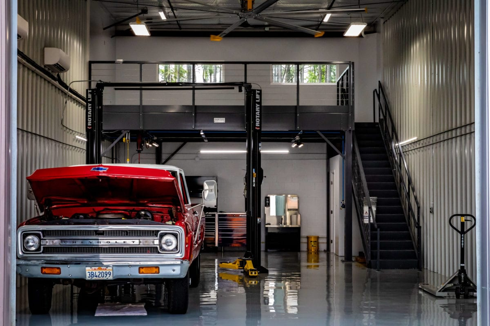

<h1 align="center">Garage_Tracker_API</h1>


<h3 align="center"> Tracking the history of your car maintenance</h3>

<p align="center"> </p> 


## Table of Contents
* [User Stories](#User-Stories)
* [Tools Used](#Tools-Used)
* [Installation](#Installation)
* [POM Dependencies](#POM-Dependencies)
* [Entity Relationship Diagram (ERD)](#Entity-Relationship-Diagram)
* [Model View Controller System Design](#Model-View-Controller-System-Design)
* [API Endpoints](#Endpoints)
* [Database Layout](#Database-Layout)
* [Sample of Output](#Sample-of-Output)
* [Project File Structure](#Project-Structure)
* [Project Class Diagram](#Class-Diagram)

This project is just one part of a two part project. This backend API holds the data for the garage.
Data can be written to and read from the database from the front end component of the project. 
The user would be able to store their vehicle data such as make, model, year, as well as VIN. 
Each vehicle can contain records of work done on the vehicle such as oil changes, gas fill ups, 
and any other maintenance records. 

### The Approach
I first started with the ERD to flush out how the API would be structured. 
This made the subsequent work much easier because the planning was done ahead of touching any code.


### Unsolved Problems or Major Hurdles


### Todo


## User Stories


## Tools Used

|                                                                              |               |
|:----------------------------------------------------------------------------:|:-------------:|
|      |  Spring Boot  |
|  | IntelliJ IDEA |
|                    |     Java      |
|                | Apache Maven  |
|             |  PostgreSQL   |
|                   |    Postman    |
|                 |    Heroku     |
|               |  Lucidcharts  |


## Installation


## POM Dependencies
```xml
<dependencies>
        <dependency>
            <groupId>org.springframework.session</groupId>
            <artifactId>spring-session-core</artifactId>
        </dependency>

        <dependency>
            <groupId>org.springframework.boot</groupId>
            <artifactId>spring-boot-devtools</artifactId>
            <scope>runtime</scope>
            <optional>true</optional>
        </dependency>
        <dependency>
            <groupId>org.postgresql</groupId>
            <artifactId>postgresql</artifactId>
            <scope>runtime</scope>
        </dependency>
        <dependency>
            <groupId>org.springframework.boot</groupId>
            <artifactId>spring-boot-starter-test</artifactId>
            <scope>test</scope>
        </dependency>
        <dependency>
            <groupId>org.springframework.security</groupId>
            <artifactId>spring-security-test</artifactId>
            <scope>test</scope>
        </dependency>
        <dependency>
            <groupId>org.springframework.boot</groupId>
            <artifactId>spring-boot-starter-data-jpa</artifactId>
        </dependency>
        <dependency>
            <groupId>org.springframework.boot</groupId>
            <artifactId>spring-boot-starter-web</artifactId>
            <version>2.6.3</version>
        </dependency>
    </dependencies>
```
## Entity Relationship Diagram

### Initial ERD

### Project ERD

## Model View Controller System Design

## Endpoints

## Database Layout

## Sample of Output


## Project Structure